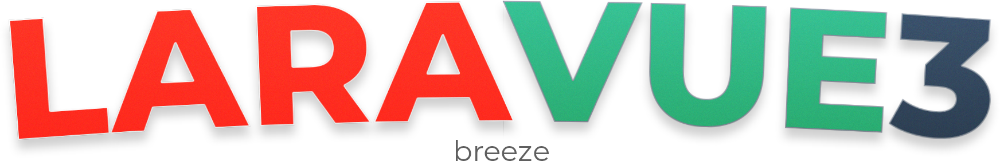

## A project template featuring Laravel, Vue 3, and TailwindCSS

For all the tinkerers who just want to code, get your next project up and running in a flash with this preconfigured Laravel + Vue + TailwindCSS stack. Just clone and start building! Laravue3 comes in 3 different flavors. This version includes basic authentication provided by the Laravel Breeze package.

## Installation
Getting started is super simple. Click [here](https://github.com/projectrebel/laravue3-breeze/generate) to generate a new repo or run the following commands to clone and install.

    git clone https://github.com/projectrebel/laravue3-breeze.git
    cd laravue3-breeze
    composer install
    npm install && npm run watch

## License

The Laravue3 is open-sourced software licensed under the [MIT license](https://opensource.org/licenses/MIT).
